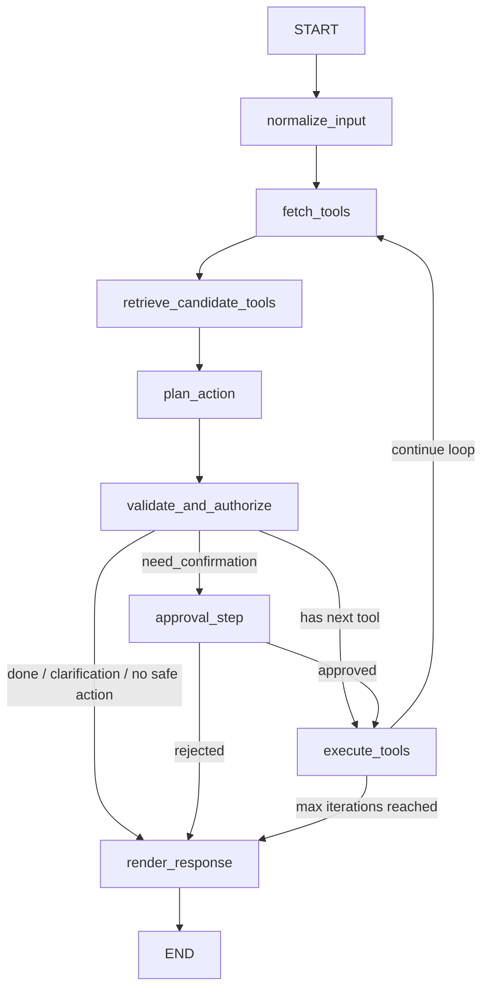

# Local LangGraph Tool-Use Service

这是一个本地运行的 LangGraph tool-use 示例项目。它把完整的工具调用链拆成 3 个独立服务：

- `Gateway`：对外提供 `/v1/chat`，负责运行 LangGraph
- `LLM Server`：提供本地 OpenAI-compatible 推理接口
- `MCP Server`：提供工具清单和工具调用入口

当前版本的重点不是“聊天”，而是让用户通过自然语言安全地调用后台工具，尤其是读写类业务工具。项目已经重构为“多轮规划 -> 执行一步 -> 观察结果 -> 再规划”的循环式 LangGraph，并保留了后续做 tool retrieval、SFT、RL 的扩展位。

## 当前能力概览

- 保留 3 进程架构：`gateway` / `llm_server` / `mcp_server`
- 每轮请求都会向 MCP 拉取一次 `/tools`
- 使用候选工具检索，而不是把全量工具直接塞给 planner
- 默认每轮只做 1 次主 LLM 调用，用于“下一步动作规划”
- 工具执行前有确定性的校验与授权逻辑
- 高风险写操作支持确认中断与恢复
- 输出层默认模板化，优先直接回答业务结果
- 内置统一 mock store，房源列表和房源详情保持一致

## 整体架构

```text
User / Client
    |
    v
Gateway (FastAPI, LangGraph)
    | \
    |  \
    |   +--> MCP Server (/tools, /invoke)
    |
    +------> LLM Server (/v1/chat/completions)
```

默认端口：

- `Gateway`: `http://127.0.0.1:8000`
- `LLM Server`: `http://127.0.0.1:8001`
- `MCP Server`: `http://127.0.0.1:8002`

## 项目结构

```text
.
├─ app/
│  ├─ common/        # 配置、日志、公共 schema
│  ├─ gateway/       # 对外 API、trace 存储、LangGraph 入口
│  ├─ graph/         # LangGraph 状态、节点、路由、planner schema、retrieval
│  ├─ llm_client/    # OpenAI-compatible LLM 客户端
│  ├─ llm_server/    # 本地模型服务
│  └─ mcp_server/    # MCP 工具服务、工具 registry、mock tools
├─ config/
│  ├─ config.yaml    # 主配置
│  └─ tools.yaml     # 工具清单与工具元数据
├─ logs/             # 运行日志
├─ models/           # 模型与 embedding 缓存
├─ init.py           # 初始化依赖、下载主模型和 embedding 模型
├─ bootstrap.sh      # Linux 初始化脚本
├─ bootstrap.bat     # Windows 初始化脚本
├─ start.py          # 启动 3 个服务
├─ start.sh
└─ start.bat
```

## LangGraph 结构

当前 LangGraph 已经不是旧版的“静态工具列表一次性规划”，而是循环式的多步执行图。

### 当前流程图



### 各节点职责

#### `normalize_input`

- 读取用户最新输入
- 做轻量归一化
- 初始化循环状态、已完成工具调用、调试字段

#### `fetch_tools`

- 每一轮都请求 `MCP /tools`
- 获取当前全量工具清单
- 保留全量工具快照，方便调试和后续训练采样

#### `retrieve_candidate_tools`

- 基于当前输入、已完成调用和现有结果做候选工具检索
- 使用本地 embedding 检索 + 词法规则召回的混合策略
- 只把 Top-K 候选工具交给 planner

#### `plan_action`

- 每轮唯一的主 LLM 调用
- 只规划“下一步要不要调用一个工具”
- 输出严格结构化字段，例如：
  - `intent`
  - `selected_tools`
  - `tool_calls`
  - `confidence`
  - `risk_level`
  - `need_confirmation`
  - `clarification_needed`
  - `direct_answer`
  - `done`
- 如果结构化解析失败，会显式标记 fallback，并进入确定性兜底规划

#### `validate_and_authorize`

- 不调用 LLM
- 执行确定性安全校验：
  - 工具是否存在
  - 参数 schema 校验
  - 必填参数检查
  - 参数标准化
  - 权限/角色检查
  - 读写分类
  - 风险等级评估
  - 是否需要确认

#### `approval_step`

- 用于高风险写操作确认
- 返回待确认状态和预览内容
- 支持通过同一 `trace_id` 恢复继续执行

#### `execute_tools`

- 每轮只执行一步工具调用
- 记录已完成调用、工具结果、执行耗时
- 执行后回到 `fetch_tools`，继续下一轮

#### `render_response`

- 默认模板化输出
- 单工具读、单工具写、多工具聚合都优先走模板
- 多轮查询会基于 `tool_results` 组织业务答案，而不是输出“工具执行成功日志”
- 当前支持根据输入语言切换中文/英文模板

## 与旧版结构的主要区别

旧版大致是：

```text
normalize_input
-> classify_intent
-> plan_tool_calls
-> execute_tools
-> review_results
-> finalize
```

当前版本变为：

- 删除了独立的 `classify_intent`
- 删除了默认 `review_results`
- 删除了默认二次 `finalize` 总结
- 改为每轮“规划一步 -> 执行一步 -> 再规划”
- 默认路径优先减少串行 LLM 调用

这能明显减少无效 LLM 开销，同时保留多跳工具调用能力。

## 当前多轮 tool-use 行为

### 典型复杂样例

用户输入：

```text
给我找到张三中介名下所有房产的信息
```

系统预期执行路径：

1. `get_agent_id_by_name`
2. `get_houses_by_agent_id`
3. `get_house_detail`（逐套房源补详情）
4. 汇总返回：
   - 经纪人是谁
   - 共找到几套房
   - 每套房的 `house_id / name / price / currency / status`

### 为什么要做成循环

因为后一步常常依赖前一步结果。例如：

- 先通过经纪人姓名拿到 `agent_id`
- 再用 `agent_id` 查询房源列表
- 再根据房源列表逐个查询详情

这类场景不适合“先静态吐完整 tool list”，更适合“拿到结果后再推理下一步”。

## Tool Retrieval

当前 retrieval 设计目标是“每轮都拉 `/tools`，但不把全量工具直接喂给 planner”。

### 当前做法

- 每轮请求 `MCP /tools`
- 对工具元数据做标准化
- 使用本地 embedding 检索
- 叠加中文词法规则和业务域过滤
- 输出候选工具 Top-K

### 本地 embedding 模型

默认 embedding 模型：

- `BAAI/bge-small-zh-v1.5`

该模型会在初始化阶段预下载到本地，服务启动时只读取本地缓存，不会在启动期临时联网拉取。

## Mock 数据

当前工具层使用统一 mock store，保证列表和详情一致。

### 一致性保证

- `agent_id -> houses` 稳定映射
- `house_id -> detail` 稳定映射
- `get_houses_by_agent_id` 和 `get_house_detail` 使用同一份 mock 数据

### 当前适合测试的输入

- `请帮我查询房源 house_demo_001 的详细信息`
- `请帮我找到张三中介名下有哪些房源`
- `给我找到张三中介名下所有房产的信息`
- `帮我查一下房源 house_demo_001 对应的中介是谁`

## API 概览

### Gateway

- `GET /health`
- `POST /v1/chat`
- `GET /v1/tools`
- `GET /v1/traces/{trace_id}`

### MCP Server

- `GET /health`
- `GET /tools`
- `GET /tools/{tool_name}`
- `POST /invoke`

### LLM Server

- `GET /health`
- `POST /v1/chat/completions`

## `/v1/chat` 返回结构

当前返回中至少包含：

- `answer`：给用户看的自然语言结果
- `tool_calls`：本次请求实际执行过的全部工具调用
- `tool_results`：全部工具执行结果
- `review_notes`：风险提示、mock 数据提示等
- `planner_iterations`：每轮 planner / validator / executor 的细节
- `raw_state`：完整调试状态

### `planner_iterations` 中的调试信息

每轮至少会记录：

- `iteration_index`
- `completed_tool_calls_snapshot`
- `candidate_tools`
- `planner_prompt_payload`
- `planner_output`
- `planner_trace`
- `validated_plan`
- `executed_tool`
- `tool_result`

这部分是后续做 SFT / 规划质量分析 / reward 打分的重要采样入口。

## 结构化输出与 fallback

当前 planner 输出使用结构化 JSON 约束，并在客户端侧做：

- JSON 抽取
- schema 校验
- 单次 repair

如果仍然失败，会明确记录：

- `parsed_ok`
- `repaired`
- `fallback_used`
- `fallback_reason`

不会再出现“trace 里看不出 planner 到底怎么做决策”的情况。

## 启动与初始化

### Linux

初始化环境：

```bash
chmod +x bootstrap.sh start.sh
./bootstrap.sh
```

启动服务：

```bash
./start.sh
```

### Windows

初始化环境：

```bat
bootstrap.bat
```

启动服务：

```bat
start.bat
```

## `bootstrap` 和 `init.py` 现在做什么

### PyTorch 安装策略

当前策略是：

- `bootstrap.sh` 负责安装 `torch / torchvision / torchaudio`
- `init.py` 不再安装 torch 家族
- Linux + NVIDIA 场景下，在目标 conda 环境里用 pip wheel 安装：
  - `torch==2.8.0`
  - `torchvision==0.23.0`
  - `torchaudio==2.8.0`
  - `https://download.pytorch.org/whl/cu128`

这样可以避免 conda / pip 混装冲突。

### 模型下载策略

`init.py` 负责：

- 升级 pip
- 安装非 torch 的 Python 依赖
- 下载主模型
- 下载本地 embedding 模型

默认主模型：

- `Qwen/Qwen3.5-4B`

默认下载策略：

- 优先国内 pip 镜像
- 优先 `ModelScope`
- Hugging Face 默认走镜像端点 `https://hf-mirror.com`

### 服务启动时的 embedding 行为

- embedding 模型在初始化阶段下载
- 服务启动时只从本地缓存加载
- 启动阶段不再临时联网下载 embedding 模型

## 当前配置要点

主配置文件：

- [config.yaml](/E:/something%20I%20can%20turn%20to/HouGarden/Tool-Use/LangGraphTest/config/config.yaml)

关键配置项包括：

- `project.environment_name`
- `llm.model_name`
- `llm.service.model_source`
- `llm.planner_max_tokens`
- `llm.planner_temperature`
- `llm.summarize_enabled`
- `retrieval.enabled`
- `retrieval.model_name`
- `retrieval.model_cache_dir`
- `retrieval.top_k`
- `retrieval.similarity_threshold`
- `mcp.manifest_path`
- `gateway.service.port`

## 日志与排障

默认日志目录：

- `logs/gateway.log`
- `logs/llm.log`
- `logs/mcp.log`

### 如何快速判断慢点在哪

- 如果 `llm.log` 中单次 `/v1/chat/completions` 很慢，瓶颈在模型推理
- 如果 `mcp.log` 很快，而 `gateway.log` 总耗时长，重点看 planner 轮次和循环次数

### 推荐先看的字段

- `execution_trace`
- `planner_iterations`
- `tool_calls`
- `tool_results`
- `review_notes`

## 如何扩展

如果要继续把项目往真实业务方向推进，推荐按下面顺序扩展：

1. 用真实数据源替换 `app/mcp_server/tools/` 下的 mock 实现
2. 丰富 `config/tools.yaml` 中的中文描述、权限标签、业务域和风险等级
3. 把 `planner_iterations` 落到持久化存储，做 SFT 训练样本采集
4. 在 `retrieve_candidate_tools` 接入更强的 embedding / reranker 检索
5. 为写操作接入更完整的审批、审计和权限体系

## 当前边界

当前项目已经具备“本地可运行的多轮 tool-use 闭环”，但仍有明确边界：

- 工具层目前仍以 mock 数据为主
- trace 默认保存在内存
- planner 的结构化输出虽然已增强，但仍可能走 fallback
- 写操作确认目前是最小可用版
- 还没有接入真实权限系统、持久化层和审计系统

如果你的目标是验证“本地 LangGraph + tool-use + 多轮循环 + 可调试 trace”链路，这个版本已经足够；如果目标是直接上生产，还需要继续补业务接入和治理能力。
